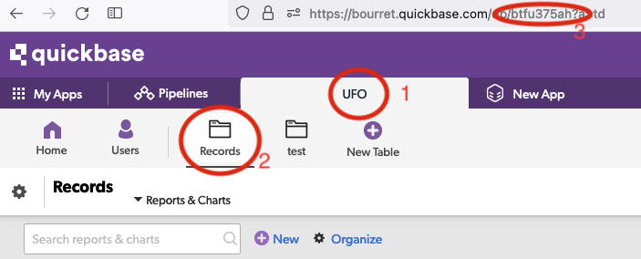

# Quickbase Plugin

This DSS plugin provides a read connector to interact with documents stored on [Quickbase](https://www.quickbase.com/).

## Installation

1 - On Quickbase, create a user token to be used with your existing Quickbase App. To do so, click on the top right menu > My preferences > Manage User Tokens > + New user token. Name and create a new token and assign it to your app. Finally, copy the token value.

2 - As a DSS admin, install the plugin by Applications > Plugins > Add plugin > Fetch from Git repository and add this repository.

3 - Once the plugin is installed, go to Applications > Plugins > Quickbase > Installed > Quickbase > Settings > Tokens > +Add preset.

4 - Name the preset, add the realm name for your Quickbase instance, and paste the user token copied from step 1.

## How to use

In your Quickbase instance, click on your app tab, followed by **Records** and copy the table ID from the URL. The table ID is the charater string between **/b/** and **?**

In your DSS flow, add the Quickbase connector (+Dataset > Quickbase > Query Quickbase records). Select the right token preset created earlier by the DSS admin, paste the table ID, and press **Test & get schema**

### Licence

This plugin is distributed under the Apache License version 2.0
